<!DOCTYPE html>
<html lang="en">
<head>
    <meta charset="UTF-8">
    <meta http-equiv="X-UA-Compatible" content="IE=edge">
    <meta name="viewport" content="width=device-width, initial-scale=1.0">
    <title>Herdi Portofolio's</title>
</head>
<body>
    <h1>Herdi Heryadi</h1>
    <h2>Junior Web Developer</h2>
    
Berikut adalah portofolio web yang saya buat selama mengikuti course Udemy The complete web developer : 

    

    <h2><a href="../2.4 Movie Ranking Project/index.html">Anime Ranking Project</a></h2>
    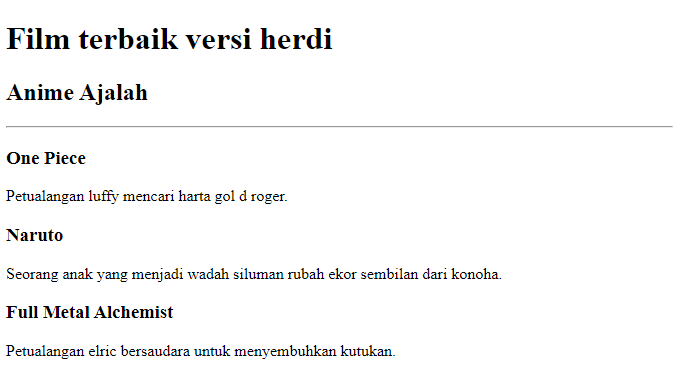
    
Merupakan kumpulan anime yang saya sukai dan recommended untuk ditonton

    

    <h2><a href="../3.0 List Elements/index.html">Project List Elements</a></h2>
    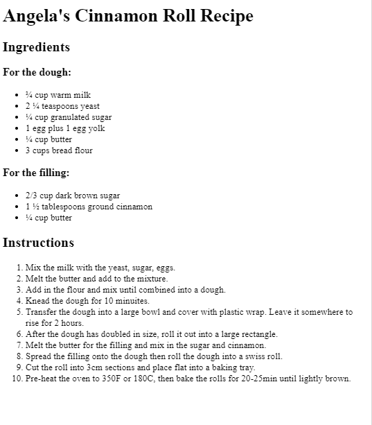
    
Merupakan Project list element resep

    

    <h2><a href="../3.1 Nesting and Indentation/index.html">Project nesting dan indentasi</a></h2>
    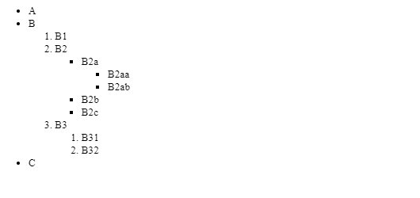
    
project mempelajari nesting dan indentasi

    

    <h2><a href="../3.2 Anchor Elements/index.html">Project anchor elements</a></h2>
    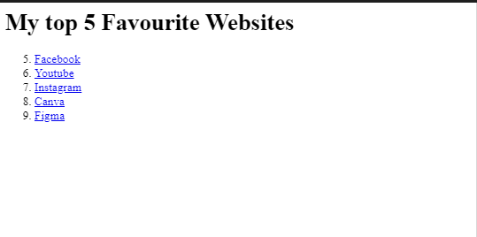
    
Project memepelajari menambahkan gambar pada web

    

    <h2><a href="../3.3 Image Elements/index.html">Project image elements</a></h2>
    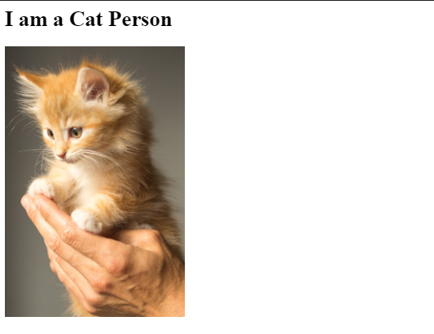
    
Project Image element untuk hyperlink image dalam website

    

    <h2><a href="../3.4 Birthday Invite Project/index.html">Birthday Invitation</a></h2>
    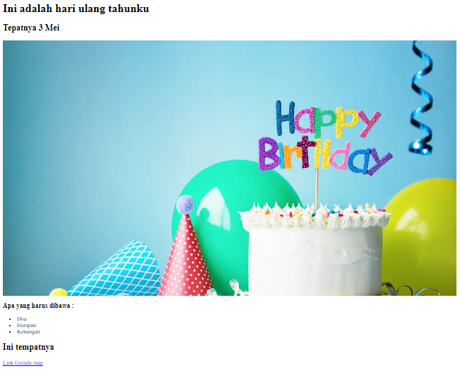
    
Project ulang tahun

    <h2><a href="../4.0 File Paths/Folder0/index.html">File Path Project</a></h2>
    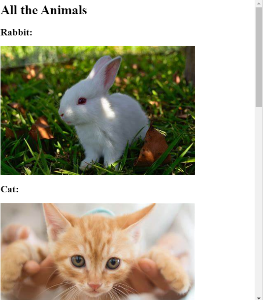
    
Project filepath image

    <h2><a href="../4.1 Webpages/index.html">Webpage Project</a></h2>
    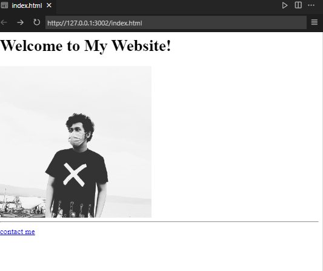
    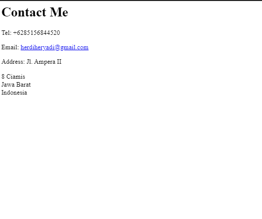
    
Project Webpages pertama (mungkin)

    

    <h2><a href="../4.2 htmlBoilerplate/project1.html">Webpage Project</a></h2>
    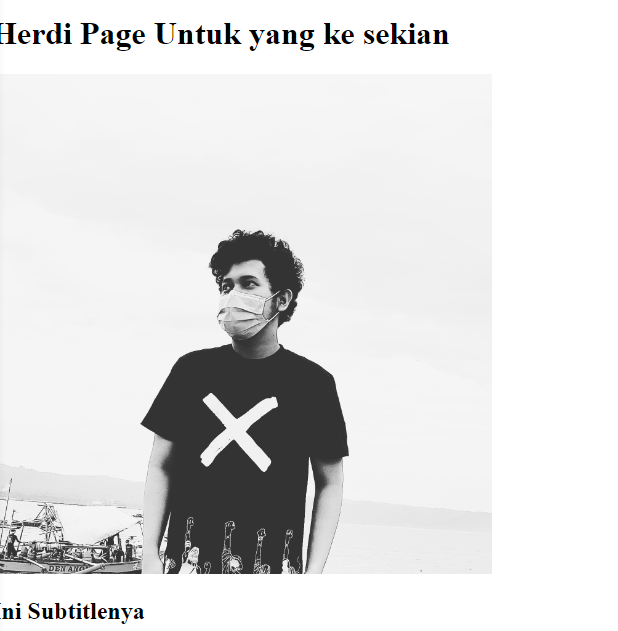
    
Project htmlBoilerplate

    

    <h2><a href="indexPortofolio.html">Portofolio web</a></h2>
    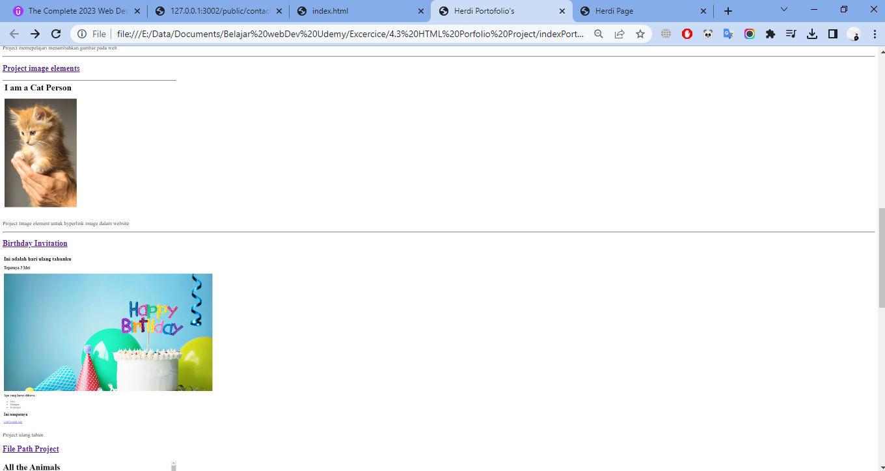
    
Merupakan kumpulan web yang sudah dibuat sebelumnya

</body>
</html>
